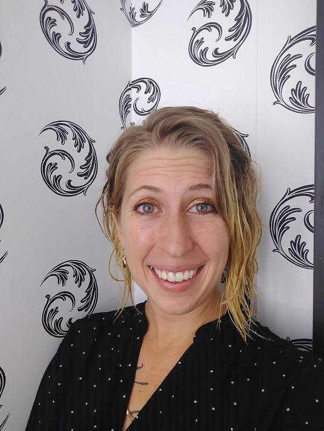
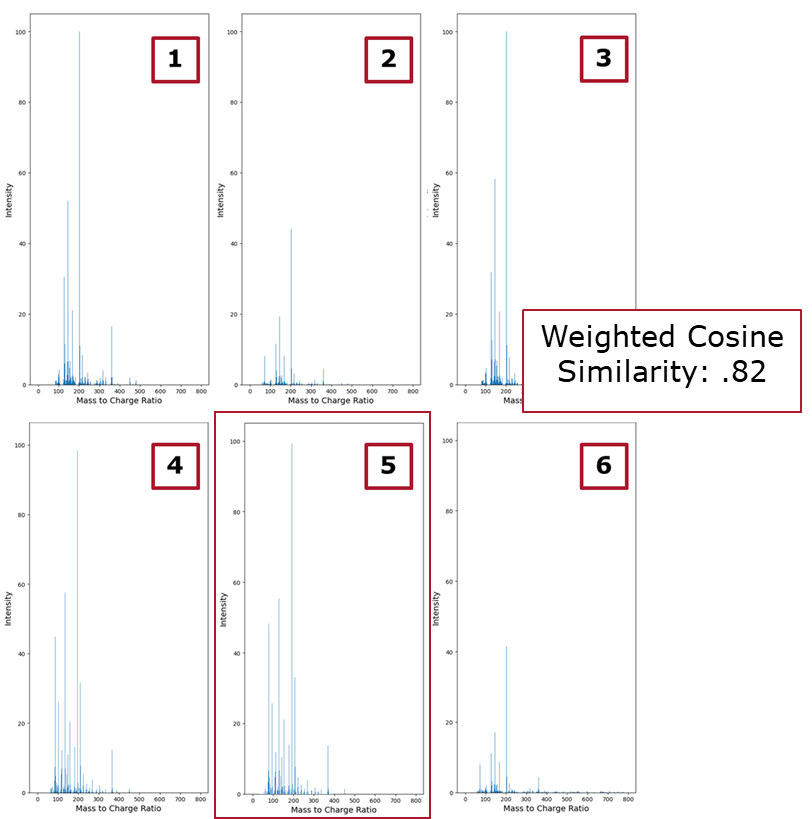
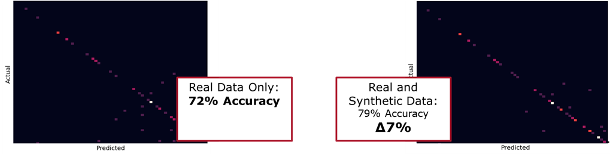
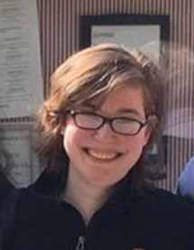
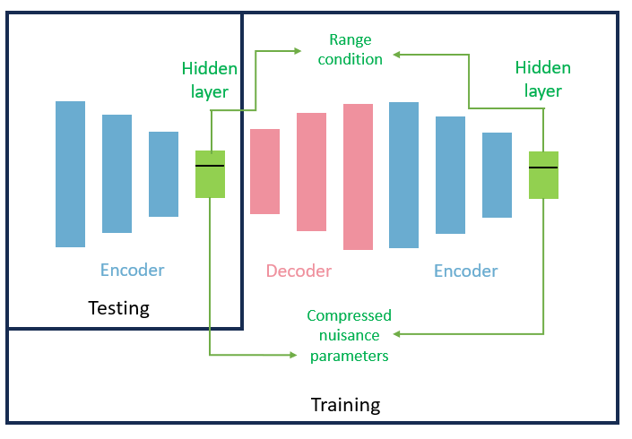
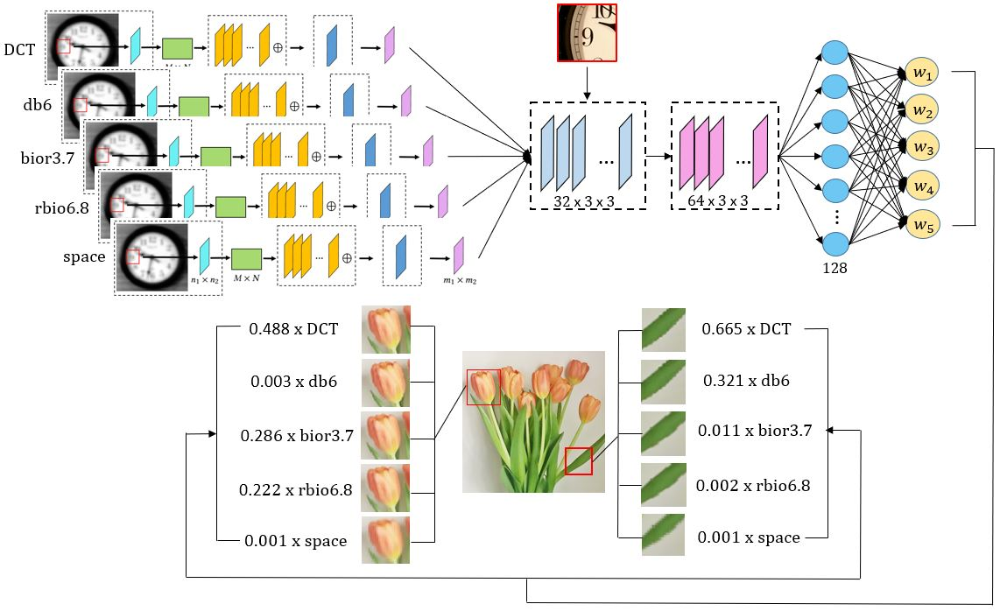
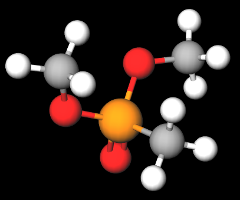
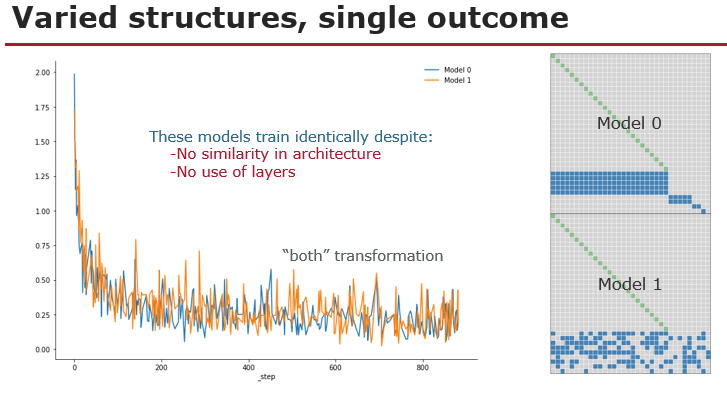

# Cate Dunham
*Data Science PhD Student*

## Oracle Embeddings for Chemical Data Generation

The accurate detection of chemical agents promotes many national security and public safety goals, and mass spectrometry 
is an important tool to this end. However, the high cost associated with acquiring lab-generated mass spectrometry data 
hinders the development of machine learning models to detect and identify chemical agents. 
Accordingly, the primary objective of our research is to create a mass spectrometry data generation model whose output 
(synthetic mass spectrometry data) would enhance the performance of downstream chemical classification models. Such a 
synthetic data generation model would reduce the need to generate costly real-world data and provide additional training 
data to use in combination with lab-generated mass spectrometry data when training classifiers.
Our approach is a novel combination of autoencoder-based synthetic data generation combined with a fixed, apriori 
defined hidden layer geometry.
In particular, we train pairs of encoders and decoders with an additional loss term that 
enforces that the hidden layer passed from the encoder to the decoder match the embedding provided by an external deep 
learning model designed to predict functional properties of chemicals.
We have verified that incorporating our synthetic spectra into a lab-generated dataset enhances the performance of 
classification algorithms compared to using only the real data. Our synthetic spectra have been successfully matched 
to lab-generated spectra for their respective chemicals using library matching software, further demonstrating the 
validity of our work.

# Nitish Bahadur
*Data Science PhD Student*

## Non-linear dimenionality reduction techniques in Finance

Financial markets are high-dimensional, complex, and constantly changing.  Under stressed market conditions the
changes are amplified.  Financial market can be represented by an underlying manifold in low-dimension that captures
the inherent characteristics of the high-dimensional data.  Using Russell 3000 constituents and both geodesic and
informational geometric schemes, we determine the temporal dimensionality of US market.  Further, we use rate of
change in US market dimensionality over 30 years to detect early warning system. Additionally, using intra-day prices
we zoom into temporal dimensionality around large market movements to detect early perturbation in financial system.
We not only study the benefit of using non-linear techniques such as Isomap, over linear technique such as PCA or
Multidimensional Scaling but also compare and contrast the use of geodesic distance and informational geometric distances.

### Publications
  * [Bahardur Paper 1](papers/bahadur_Paper1.pdf)

# Lauren Baker
*Industrial Mathematics MS Professional Project Student*

## Compressive Sensing on Carbon Nanotube Sheet Quality Control Data

The goal of this project is to apply compressive sensing techniques to measurements provided by Nanocomp Inc.,
a company producing carbon nanotube products. This project is concerned with the thickness and uniformity of
carbon nanotube sheets. Taking advantage of the sparsity of this data when transformed from the spatial to the
Fourier domain, research will determine if this property can be used to generate accurate higher-resolution data
on these sheets. This will ultimately allow Nanocomp to measure the effects of changes in their production process
on sheet quality.

# Maria (Mia) Barger
*Data Science PhD Student*

## Conditioned Cycles for Data Generation in Sparse Data Environments

My research focuses primarily on novel contributions to neural network architecture to facilitate data generation in sparse data environments. Using a cyclic autoencoder structure, my neural networks are able to produce useful generated data in extremely low-data environments while also producing regression predictions based on real-world and generated data. By adding conditioning, a term we use in the sense of classical statistics’ conditional probabilities, I am able to generate data based on specific, user-determined parameters. Generally, I focus on the real-world application of electromagnetic signal source localization but will be expanding my research to show the applicability of my algorithms to other real-world problems.

### Education
B.S. University of New Hampshire, Mathematics, 2019

# Melanie Jutras
*Data Science MS-Thesis Student*

## Robust Principal Component Analysis  for Anomaly Detection in Cyber Network Data

The goal of this research is to utilize Robust Principal Component Analysis (RPCA) for the purpose of anomaly
detection in DNS network packet data. Computer network traffic meets all of the criteria for Big Data. When
dealing with high dimensional data, Principal Component Analysis (PCA) is a common technique used for dimensionality
reduction. Because traditional PCA is known to be sensitive to outliers, a robust version of PCA called RPCA is used.
Through the use of a tuning parameter, RPCA can be used to separate the original data into two parts: regular network
data and anomalous network data. This data science technique allows for tuning a model utilizing a very small amount
of training data.  The method described here is useful for cybersecurity because these types of problems are largely
unsupervised and often involve high dimensional network data with sparse anomalies.

### Publications
  * [Paper 1](papers/jutras_Paper1Title.pdf)
  
  
# Kelum Gajamannage
*Mathematial Sciences Postdoctoral Scholar*

## Manifold Learning and Dimensionality Reduction

My research is mainly focused on developing robust Nonlinear Dimensionality Reduction (NDR) algorithms to embed
data accurately. Specifically, I am researching on extensions of the classic Isomap method by using smoothing
splines those are robust even when the data is sparse and contaminated with noise. Herein, we can fit geodesics
in Isomap by smoothing splines with a specific smoothing parameter and then the distances on the manifold are
approximated as the lengths of these splines. The smoothing spline scheme is capable of eliminating issues with
noise and scarcity and assures a faithful embedding. We can also utilize smoothing splines for NDR while preserving
the geometry of the higher dimensional data. For that, we first make higher dimensional slices of the data in *n*
orthogonal directions and then fit data in each slice by a cubic smoothing spline. All the cubic smoothing splines
represent a grid structure that we use as the $$n$$ dimensional coordinate system to measure the distances on
the manifold. I am also interested of generalizing Isomap to the case where both geodesics and smoothing splines
are not good approximations of long manifold distances. In such a case, one can attempt to treat the long manifold
distances as unknown, and employ matrix completion techniques on distance matrices ($$D$$), where some entries
are not observed, to recover the distance matrix such that $$D = S + L$$, where $$S$$ is a sparse matrix
and $$L$$ is a low rank matrix.

### Publications
  * [Paper 1](papers/gajamannage_papers.pdf)

# Wenjing Li
*Mathematical Department PhD Student*

## Large Scale Ensemble Learning

Ensemble learning is a very important technic in machine learning, and it is also widely used in industrial field
because of the good performance on predictions and classifications. However, the reason why it works so good is
rarely understood. This project aims to figure out the mysterious parts of ensemble learning and even develop some
theorems that support ensemble learning. Generally speaking, ensemble learning is a process by which multiple models,
such as classifiers or experts, are strategically generated and combined to produce a better algorithm. It is
primarily used to improve the classification or prediction performance of a model, or to reduce the risk of selecting
a poor model. Therefore, there are two major focuses of ensemble learning: the first one is the process of model
generation and selection, and the other one is the model combining strategy.

### Publications

* [Paper 1](papers/Wenjing_Paper1Title.pdf)

# Haitao Liu
*Data Science PhD Student*

## Robust Graphical Lasso Anomaly Detection

Gaussian graphical model is
widely used to study the network structure. However, the standard gaussian graphical
model is very sensitive to outliers. The existing outliers or anomalies can result
in a dense information matrix (dense network structure) rather than a desired sparse
information matrix. So there is a need to develop a robust procedure to filter out the
anomalies and identify a sparse graphical structure. In this paper, we take the
advantage of Robust Principle Analysis to add a l1 penalty of a sparse anomaly matrix
to graphical lasso, and subject to the constraint that the summation of the input
covariance of the sparse anomaly matrix equals to the observed sample covariance matrix.
We also propose an ADMM solution to detect the anomaly. The advantage of the algorithm
is that the ADMM solution can handle large scale data efficiently.

### Publications
  * [Paper 1](papers/haitao_Paper1Title.pdf)

# Yingnan Liu
*Data Science PhD Student*

## Ensemble CNNs in the Frequency Domain for Image Super-resolution

This study aims to recover high-resolution images from low-resolution images by combining ideas inspired by compressive sensing, super-resolution neural networks, and ensemble learning. The key idea is that the frequency domain, and other transformed domains, where images can be presented sparsely can be used to improve the performance of super-resolution convolutional neural networks. We developed a model called SparseFnet which computes the cost in each iteration between frequency representations directly. Learning features from the frequency domain leads to a better reconstruction quality and higher computational efficiency, even with a shallow architecture. Furthermore, we proposed an ensemble method for selecting the appropriate sparsifying transform across different image patches. Our algorithm has been developed to leverage the advantages from multiple transformation domains and provide a universal solution for various types of images. 

### Education
  * M.S. Worcester Polytechnin Institute, Applied Statistics, 2016
  * B.S. University of Waterloo, Mathematical Physics, 2013
  
### Publications
  * [Paper 1](papers/Yingnan_Paper.pdf)
  
  
# Alexander Moore
*Data Science PhD Student*

## Relational Inference, Manifold Learning, a new take on Expert Systems

Relational inference between complex joint data distributions is a common challenge in high-dimensional statistics. The challenges presented are accentuated from rich data distributions in sparse data domains. By leveraging external information to a dataset such as unpaired data and domain knowledge, we can learn a manifold and sample from it to improve our models. This kind of information incorporation is explored with Learning Under Privledged Information, conditioning, and uniting theory behind GANs, Autoencoders, and learned latent spaces. In some fields we have centuries of domain knowledge - why not use it?

### Education
  * B.A. Reed College, Mathematics and Statistics, 2019

# Matt Weiss
*Data Science PhD Student*

## Optimal Filtering for Deep Learning

Filtering is the process of recovering a signal, $$x(t)$$, from noisy measurements, $$z(t)$$.  One common filter is
the Kalman Filter, which is proven to be the optimal unbiased linear filter under certain conditions.  One
such condition is that the noise present in $$z(t)$$, obscuring $$x(t)$$, is a zero-mean Gaussian process with known
covariance $$R$$.  However, in practice the determination of the actual R is problematic and often tuned using
cross-validation and domain knowledge.  In our current research we approach the problem in a different way.
Instead of tuning $$R$$ based on cross-validation and Kalman Filter performance, we fix $$R$$ and learn a transformation
of the measurements, $$z(t)$$, which improves Kalman Filter performance.  As this transformation needs to receive
feedback from the Kalman Filter, an artificial neural network is an ideal candidate.  Specifically, the
transformation is done using an autoencoder to first encode $$z(t)$$, use the encoded data as input to a Kalman
Filter and then decode the Kalman Filter's output.  Using simulated data we show the Kalman Filter's estimate
of $$x(t)$$ is more accurate when accompanied by an autoencoder.  A preliminary result of this autoencoder/Kalman
Filter hybrid is that it is not necessary to know R *a priori* or estimate it experimentally.

## Applications of the Kalman Filter to Chemical Sensors for Downstream Machine Learning

Chemical sensors play an important role in a variety of civilian and military domains.  In these contexts,
the ability to accurately and quickly identify chemical agents is of utmost importance.  In practice,
constraints on physical footprint, power consumption, ease of use and time required for accurate detection
often restrict the utility of sensors, particularly in remote and isolated regions.  One solution to address
this problem is the engineering of advanced signal processing techniques which decrease the time required
for accurate detection and allow software to facilitate the construction of hardware that meet stringent
power and concept of operations guidelines.  In this research, we propose the Kalman Filter as a preprocessing
technique applicable to chemical sensor time series data for downstream machine learning.  Using data collected
from a sensor array of multiple unique polymer-graphene nanoplatelet coated electrodes we show accurate and
early detection of both organophosphates and interferents is improved when the Kalman Filter is used as a
preprocessing technique.  In particular, within two seconds of analyte exposure to the sensor array,
classification using Kalman Filtered first derivative estimates achieve an error of less than 10%.  By
comparison, the non-Kalman Filtered dataset has a classification error rate above 40% within this time.
An advantage of our approach is classification does not depend on a set parameter, such as maximum resistance
change, or a pre-determined exposure time, which allows rapid classification immediately after analyte
introduction.

# Xiaozhou (Joe) Zou
*Data Science MS-Thesis Student*

## Investigation on Using Randomness Technique to Improve GAN and Mechanism of Batch Normalization

This research is done to better understand Generative Adversarial Networks(GAN). GAN is a deep learning
architecture that trains two neural networks simultaneously. Among the two networks, one is called generator
and the other is called discriminator. The generator samples from random noise and generate meaningful data,
be it image of sound. The discriminator takes as input real data and fake data generated by the generator and
tries to distinguish them as well as it can. By competing with each other, both generator and discriminator
become better. This architecture is notorious for its instability. It is easy for this architecture to collapse,
which means to generate meaningless results. The two goals in this research are both related to the collapse
problem of GAN. The first goal is to improve the performance of Generative Adversarial Networks using randomness
technique. That is, we hope to improve the convergence rate or the quality of the result via introducing randomness
to the training process. Another topic is to understand why batch normalization works so well in solving the
collapse problem. To reach this goal, I decompose the batch normalization and try to block some components of batch
normalization. I also try to replace the Z-score transformation, which is originally used in batch normalization,
by the min-max normalization. This research is still in progress and more results will be added later on.

### Publications
  * [Paper 1](papers/joe_Paper_Title.pdf)

# Quincy Hershey
*Data Science PhD Student*

## Random Sparsely Parameterized Network Architectures

Sparse parametrizations have been demonstrated to allow inference capabilities in memory or computationally constrained deployments.  By pruning parameterizations, networks with less than 20% of the total parameter count can routinely maintain the accuracy of the full network.  In some cases, performance may also be improved through the use of sparse networks.  Randomly parameterized sparse networks take this a step further by implementing the sparse configuration prior to training with the goal of improving training efficiency and performance.  Analysis has shown randomly initialized architectures may perform in a virtually indistinguishable manner versus dense or pruned configurations with added gains in performance stability.

